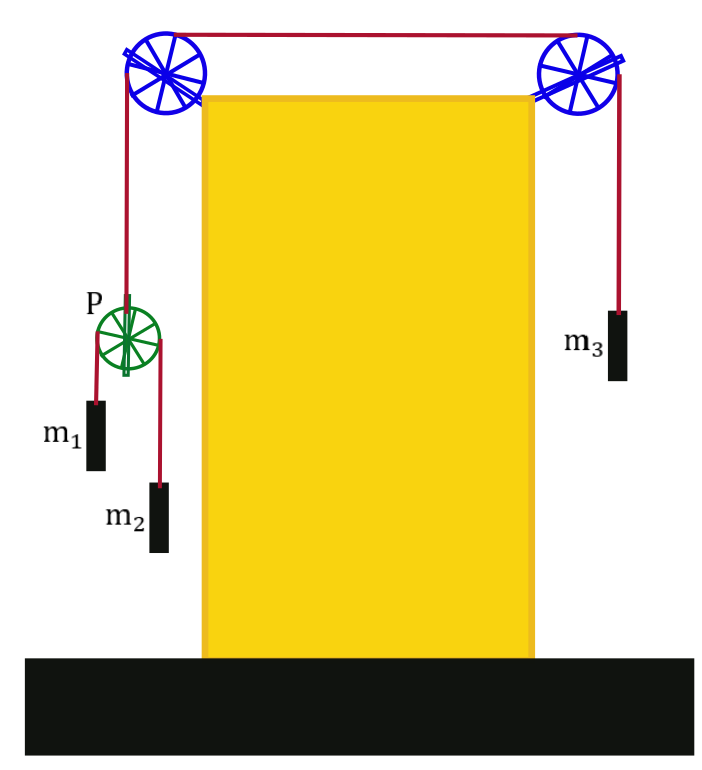
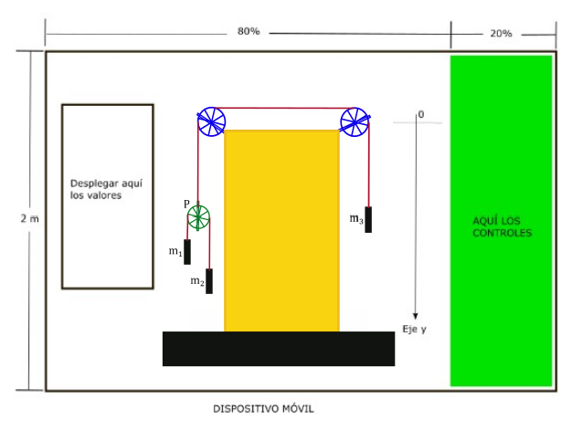

# Análisis del modelo físico — MiVigesimaQuintaApp

Taller final del módulo 10 (`VII. Simulaciones/modulo_10.docx`). Curso Simulaciones IV,
Universidad Nacional de Colombia – Sede Medellín.

## 1. Descripción del sistema

La escena a simular es la de la Figura 12A del taller, que es exactamente la misma
disposición de poleas y masas ya construida en `MiVigesimaSegundaApp`
(módulo VI — "Creación de Librería"):



- Dos poleas **fijas** e **ideales** (sin masa, sin fricción), ancladas a las esquinas
  superiores de una columna, unidas por una cuerda superior horizontal.
- Esa misma cuerda superior, del lado izquierdo, baja y sostiene el eje de una polea
  **móvil** e ideal, `P`.
- Sobre la polea `P` pasa una **segunda** cuerda ideal, independiente de la primera, de la
  que cuelgan las masas `m1` (izquierda) y `m2` (derecha).
- Del lado derecho, la cuerda superior baja directamente hasta la masa `m3`.
- Todas las cuerdas son inextensibles y sin masa.

Este arreglo es el problema clásico conocido como **máquina de Atwood doble** (double
Atwood machine): una polea fija (aquí, redundada en dos poleas fijas conectadas por un
tramo horizontal, pero mecánicamente equivalente a una sola, porque ambas son ideales) de
la que cuelgan, de un lado, la masa `m3`, y del otro, una polea móvil de la que a su vez
cuelgan `m1` y `m2`.

**Convención de ejes** (Figura 12B): origen en la altura de las poleas fijas, eje `Y`
positivo hacia **abajo**.



**Escala a unidades SI**: el 100% del alto de la pantalla, en posición *landscape*,
equivale a 2 m (dato de la ayuda del taller). Esa es la única conversión pixel↔metro que
usa `ModeloFisico`; el resto de la geometría (radios de poleas, tamaño de los bloques,
longitudes de cuerda) se hereda tal cual de `MiVigesimaSegundaApp`, expresada en
porcentaje del alto de pantalla mediante la clase `CR`.

## 2. Supuestos

1. Poleas ideales: sin masa y sin fricción en su eje. Por lo tanto no almacenan energía
   cinética rotacional y la tensión es uniforme a lo largo de toda cuerda que pasa por
   ellas.
2. Cuerdas ideales: inextensibles y sin masa.
3. Los bloques se sueltan desde el reposo (`v(0) = 0`), tal como indica el taller.
4. Movimiento puramente vertical (1 grado de libertad efectivo, dado que las dos
   ligaduras de cuerda reducen los 4 grados de libertad iniciales — posición de `m1`,
   `m2`, `m3` y `P` — a 2 grados de libertad independientes).

## 3. Ligaduras (cuerdas inextensibles)

Sea `y1, y2, y3, yP` la posición (en metros, eje `Y` hacia abajo) de `m1`, `m2`, `m3` y del
eje de la polea `P`, respectivamente.

**Cuerda superior** (pasa por las dos poleas fijas; conecta `m3` con el eje de `P`). Su
longitud total es la suma de: el tramo que baja hasta `m3`, el tramo horizontal fijo entre
las dos poleas fijas (constante) y el tramo que baja hasta `P`:

```
y3 + (constante) + yP = L1 = constante
```

Derivando dos veces respecto al tiempo:

```
a3 = -aP          (Ligadura 1)
```

Es decir, si `P` baja, `m3` sube exactamente lo mismo, y viceversa — como en una máquina
de Atwood simple.

**Cuerda inferior** (pasa por la polea móvil `P`; conecta `m1` con `m2`). Su longitud es
la suma de los dos tramos que bajan desde `P` hasta cada masa:

```
(y1 - yP) + (y2 - yP) = L2 = constante
```

Derivando dos veces:

```
a1 + a2 = 2·aP     (Ligadura 2)
```

## 4. Segunda ley de Newton

Sea `T_inf` la tensión (uniforme) de la cuerda inferior (la que pasa por `P`), y `T_sup`
la tensión (uniforme) de la cuerda superior (la que pasa por las dos poleas fijas).

Para cada masa (eje `Y` positivo hacia abajo, por lo que el peso `m·g` es positivo y la
tensión, que tira hacia arriba, es negativa):

```
m1·a1 = m1·g - T_inf
m2·a2 = m2·g - T_inf
m3·a3 = m3·g - T_sup
```

Y para la polea móvil `P`, que por hipótesis no tiene masa, la fuerza neta sobre ella debe
ser cero. De la cuerda inferior bajan dos tramos que tiran de `P` hacia abajo con tensión
`T_inf` cada uno; de la cuerda superior sube un tramo que tira de `P` hacia arriba con
tensión `T_sup`. Entonces:

```
T_sup = 2·T_inf
```

## 5. Solución del sistema

Con las 5 incógnitas `a1, a2, a3, aP, T_inf` (y `T_sup = 2·T_inf`) y las 5 ecuaciones
anteriores (2 ligaduras + 3 leyes de Newton), se define primero:

```
S = 1/m1 + 1/m2 + 4/m3
```

y la solución queda:

```
T_inf = 4g / S
T_sup = 2·T_inf = 8g / S

a1 = g - T_inf/m1
a2 = g - T_inf/m2
aP = (a1 + a2) / 2
a3 = -aP
```

Este resultado coincide con la fórmula reportada en la literatura para la máquina de
Atwood doble (con `M = m3`):

```
a3 = g · [ m3(m1+m2) - 4·m1·m2 ] / [ m3(m1+m2) + 4·m1·m2 ]
```

que es algebraicamente equivalente a la expresión anterior (puede obtenerse sustituyendo
`T_inf` en `a3 = 2·T_inf/m3 - g` y simplificando).

**Caso de verificación — equilibrio:** si `m1 = m2 = m` y `m3 = 2m`, entonces
`S = 2/m + 2/m = 4/m`, `T_inf = m·g`, `a1 = a2 = g - g = 0`, `aP = 0`, `a3 = 0`: el sistema
queda en reposo, como es físicamente esperable (el peso de `m3` equilibra exactamente el
peso combinado de `m1` y `m2` transmitido a través de la polea móvil). El valor por
defecto de la app (`m1 = m2 = 8 kg`, `m3 = 15 kg`, ligeramente por debajo del equilibrio en
`16 kg`) se eligió cerca de este punto para que la primera corrida se vea a un ritmo
pausado.

## 6. Cinemática (bloques soltados desde el reposo)

Como `v(0) = 0` para las cuatro posiciones, y las aceleraciones anteriores son constantes
mientras no cambien las masas, la posición de cada elemento en el instante `t` (medido
desde que fue soltado o desde el último reinicio) es:

```
y1(t) = y1i + ½·a1·t²        y2(t) = y2i + ½·a2·t²
y3(t) = y3i + ½·a3·t²        yP(t) = yPi + ½·aP·t²
```

donde `y1i, y2i, y3i, yPi` son las posiciones iniciales (constantes, fijadas por la
geometría heredada de `MiVigesimaSegundaApp`). Esto es exactamente lo que implementa
`ModeloFisico.setCalculos(...)`, junto con la conversión pixel↔metro.

Las rotaciones de las poleas se calculan a partir del arco recorrido por la cuerda sobre
cada una: las dos poleas fijas giran lo mismo (una sola cuerda las conecta) un ángulo
`θ_fijas = Δ(desplazamiento de P) / radioGrande`; la polea `P` gira según el desplazamiento
de la cuerda inferior **relativo a ella misma**: `θ_P = (Δy1 − ΔyP) / radioChica`.

## 7. Condición de frontera (Nota 1 del taller)

La simulación no debe permitir que los bloques choquen contra las poleas ni contra el
piso. Como en `MiVigesimaTerceraApp`, esto se implementa comparando en cada cuadro la
posición de cada bloque contra los límites geométricos de la escena:

- `m1`, `m2`: no pueden subir más allá del borde inferior de la polea móvil `P` (que a su
  vez se está moviendo), ni bajar más allá del piso.
- `m3`: no puede subir más allá del borde inferior de la polea fija derecha, ni bajar más
  allá del piso.
- Como resguardo adicional, la propia polea `P` tampoco puede acercarse a la polea fija
  izquierda ni al piso.

Cuando se viola alguno de estos límites, el tiempo de la animación se reinicia a `t = 0`,
lo que — dado que la posición es `yi + ½·a·t²` — hace que cada bloque "reaparezca" en su
posición inicial y la repetición comience de nuevo desde el reposo, tal como lo pide el
taller ("cuando alguno de los bloques llegue a un límite de estos deberá comenzar su
repetición").

## 8. Tabla de símbolos

| Símbolo  | Significado                                                    | Unidad (SI) |
|----------|------------------------------------------------------------------|-------------|
| `m1,m2,m3` | Masas de los tres bloques (variables desde la GUI)              | kg          |
| `g`        | Aceleración de la gravedad (9.8)                                | m/s²        |
| `T_inf`    | Tensión de la cuerda que pasa por la polea móvil `P`            | N           |
| `T_sup`    | Tensión de la cuerda que pasa por las dos poleas fijas          | N           |
| `a1,a2`    | Aceleración de `m1`, `m2` (positiva hacia abajo)                | m/s²        |
| `a3`       | Aceleración de `m3` (positiva hacia abajo)                      | m/s²        |
| `aP`       | Aceleración del eje de la polea móvil `P`                       | m/s²        |
| `y1,y2,y3,yP` | Posición vertical, origen en la altura de las poleas fijas   | m           |
| `t`        | Tiempo transcurrido desde que los bloques fueron soltados       | s           |
